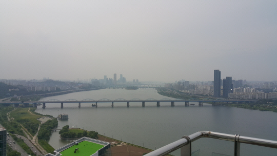
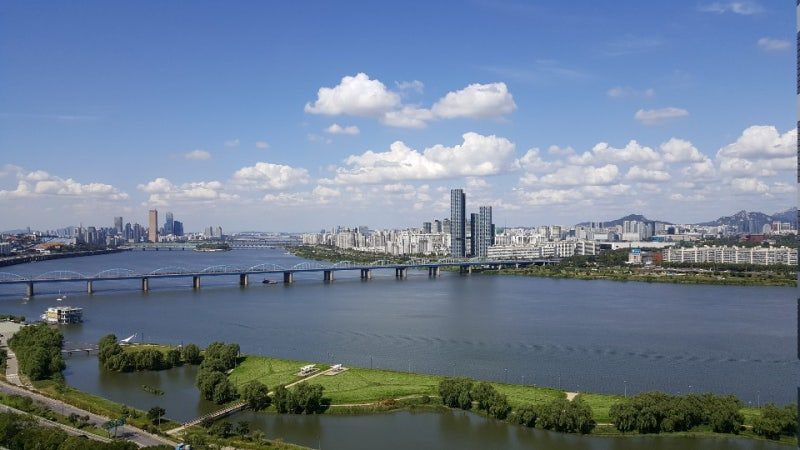
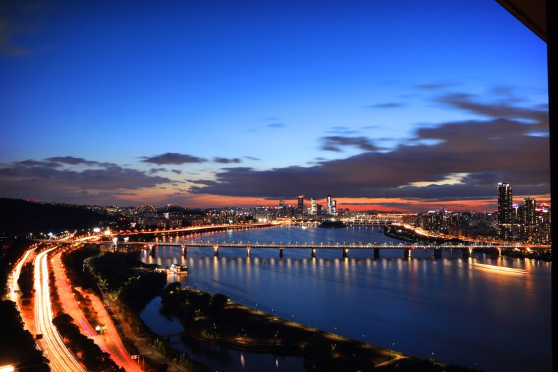
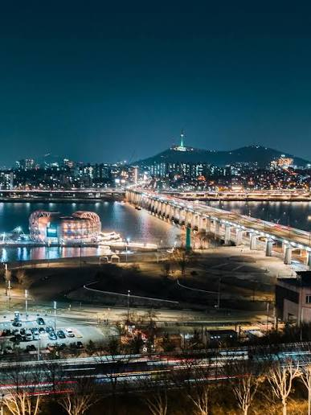
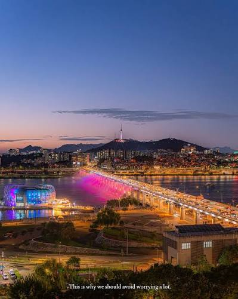
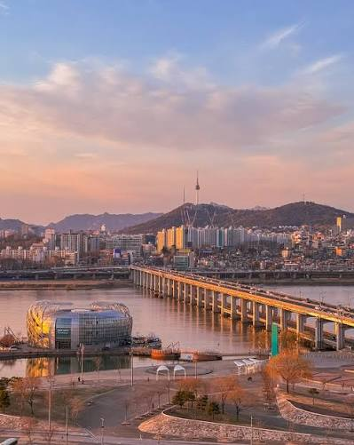
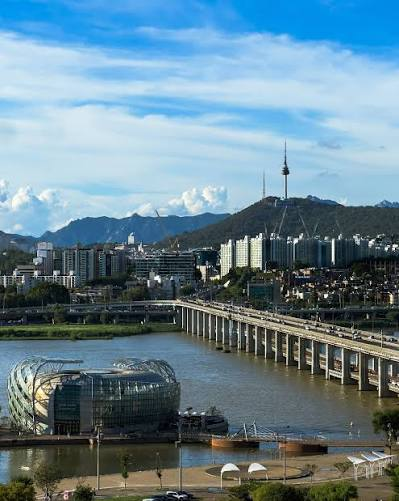
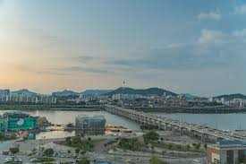
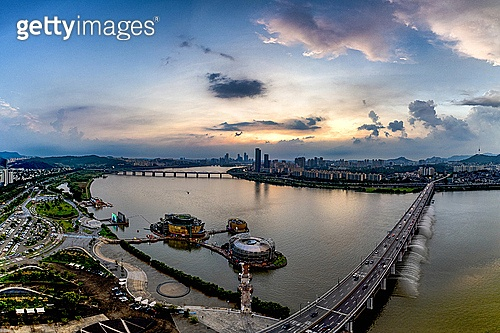
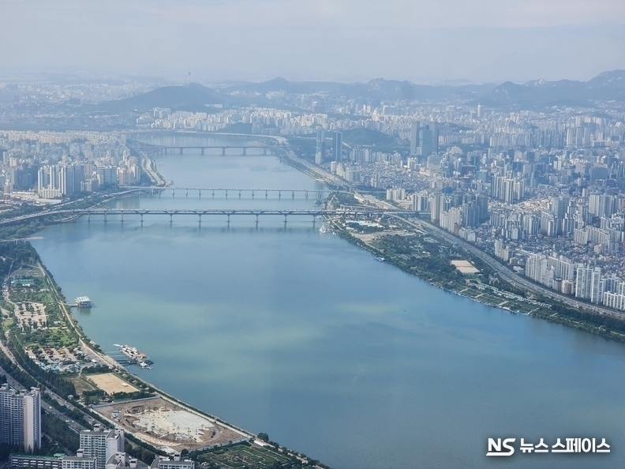

# Owner-supplied Han River references · 2026-09-09

Original user attachments retained without modification. These are composition, geometry and lighting references; they are not runtime background textures. No reference image is included in public build assets.

| Images | Role in the next scene |
| --- | --- |
| 1–3 | Broad river surface, a bridge across the middle distance, near-bank green space and deeper buildings. Image 2 is the daytime color/composition guide; image 3 is a twilight/reflection guide. Exact viewpoints have not been confirmed. |
| 4–8 | Primary geographic study: Banpo Bridge/Sebitseom toward the northern bank and Namsan. Use one consistent viewpoint for day, dusk and night. 6–7 carry the bridge piers, bank connections and relative landmark scale. |
| 9 | Wide framing and bank/bridge relationship only. Retain its visible watermark. |
| 10 | Atmospheric perspective and successive bridge depth only. Do not copy its much higher aerial viewpoint into the office window. Retain its visible watermark. |

Official geographic cross-checks: [Seoul Sebitseom](https://hangang.seoul.go.kr/www/contents/804.do?mid=528), [Seoul Research Data Service: Banpo Bridge and Namsan](https://data.si.re.kr/node/47294).

## Image 1

Source attachment: codex-clipboard-c061fefe-c335-4b25-b2cf-03bf706299aa.png

## Image 2

Source attachment: codex-clipboard-0ef359f3-324c-4066-b813-7a17b1ff9d51.png

## Image 3

Source attachment: codex-clipboard-8445f3ea-9b1b-45e2-bb40-20d060ff5bbd.png

## Image 4

Source attachment: codex-clipboard-69464f45-a936-4089-b954-60e9fb8c4ea7.png

## Image 5

Source attachment: codex-clipboard-6b636927-dd3e-464e-b8a1-ff7f826f83bf.png

## Image 6

Source attachment: codex-clipboard-d4b49d86-23d1-4643-97f9-b67924cd862e.png

## Image 7

Source attachment: codex-clipboard-5c626a27-391e-457e-9320-4a420a874c74.png

## Image 8

Source attachment: codex-clipboard-dd8a787b-17de-4758-83b3-622e2702974c.png

## Image 9

Source attachment: codex-clipboard-2dd59ee9-9c53-421a-96d9-4c7eb0e7465c.png

## Image 10

Source attachment: codex-clipboard-48c07479-12ed-4e3a-8bdf-cfc56da2a216.png
